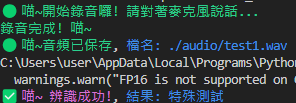

## **專案動機** 
最近使用ChatGpt-4o時，發現他的的回答變得很像在跟真人聊天一樣，而我很享受跟GPT聊天的過程，我很想用語音跟GPT聊天，但內建的語音功能，在聲音模型這方面卻不太滿意，所以想自己打造能用語音跟GPT聊天的工具。

## 專案架構

`*` 標註的資料夾僅限保存在本地，不會被推送到repo
```bash
project_root/
├── .github/workflows/
├── assets/ # 存放圖片, 影片等等
├── *audio/ # 存放待轉換的音檔
├── *role/ # 存放gpt自訂義內容，比如對話歷史、人物設定
├── *transcript/ # 存放轉錄文本
├── .env.local # .env 範本
├── .gitignore # 忽視的檔案設定
├── README.md # 使用說明文檔
├── requirements.txt # 項目依賴
└── stt.py # 主程式
```

## 一、安裝步驟

**環境準備**

1. `Python` : 開發時使用的版本為 `3.11.3`，[點我前往下載 python-3.11.3](<https://www.python.org/downloads/release/python-3113/>)
2. `ffmpeg` : [點我前往官網下載](<https://ffmpeg.org/download.html>)，載完後在電腦搜尋 `編輯系統環境變數`，找到 `PATH` 新增路徑並指定到剛剛下載的 `ffmpeg` 檔案裡的 `bin` 資料夾，設定完成後須重啟電腦使環境變數生效
3. `GPT自訂義` ( 選擇性 ) : 在根目錄建立 `role` 資料夾，並在資料夾內建立 `role_config.txt` 檔案，在檔案內可輸入自訂義的GPT描述

**安裝所需套件**

```bash
pip install -r requirements.txt
```

Noted : 遇到這個error，把 `Visual C++` 安裝好後再嘗試一次安裝TTS，[點我前往下載](<https://visualstudio.microsoft.com/zh-hant/visual-cpp-build-tools/>)
```bash
error: Microsoft Visual C++ 14.0 or greater is required. Get it with "Microsoft C++ Build Tools": https://visualstudio.microsoft.com/visual-cpp-build-tools/
```

**執行**

首次執行時，中途會遇到XTTS要求同意他們的服務條款，回答 Y 後才能繼續執行
```bash
py stt.py
```

## 二、使用的套件介紹

1. `Whisper` : 辨識語音並轉成文字檔，依賴 `ffmpeg` 所以ffmpeg務必確實安裝
2. `sounddevice` : 及時從麥克風錄音
3. `scipy` : 將聲音資料儲存為 `wav` 檔
4. `openai` : 整合Open AI 的 gpt功能
5. `json` : 用於保存歷史紀錄，比如對話歷史
6. `playsound` : 用於播放音檔

### 語音模型 : XTTS v2

開源的語音模型，能將文字轉語音

### 生成語音

以下是簡單的範本
```python
from TTS.api import TTS

# 載入 XTTS 模型
tts = TTS(model_name="tts_models/multilingual/multi-dataset/xtts_v2", progress_bar=False, gpu=False)

# 生成語音
tts.tts_to_file(
    text="你真的好笨喵…但我還是會陪你啦。",
    speaker_wav="my_voice.wav",  # 聲音樣本
    language="zh",
    file_path="output.wav"
)
```

然後你可以用 playsound() 播放這段音訊！
```python
from playsound import playsound

playsound("output.wav")
```

查看可用的 TTS 模型，會跑出數十個模型名稱，因此會跑比較久
```bash
tts --list_models
```
**懶人包推薦給你**
| 模型名稱 | 特點 | 語言 | 音質 | 支援 speaker_wav |
|---------|------|------|------|-----------------|
| tts_models/multilingual/multi-dataset/xtts_v2 | ✅ 支援語氣、聲線克隆、中文超自然！ | ✅ 多語言 | 🌟🌟🌟🌟🌟 | ✅✅✅（可自定聲音） |
| tts_models/zh-CN/baker/tacotron2-DDC-GST | 🈶 基本中文 TTS（需配 vocoder） | 🇨🇳 中文 | 🌟🌟🌟 | ❌ |
| tts_models/multilingual/multi-dataset/your_tts | 支援 speaker embedding（舊版） | 多語言 | 🌟🌟🌟 | ✅ |

## 展示影片&截圖

1. Log提示(能自定義顏色)


